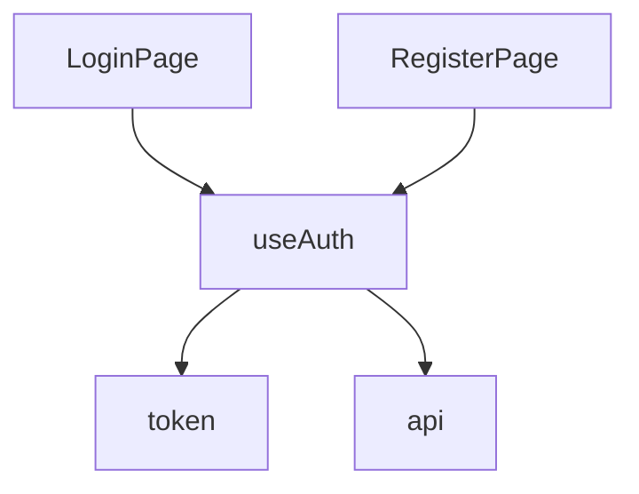
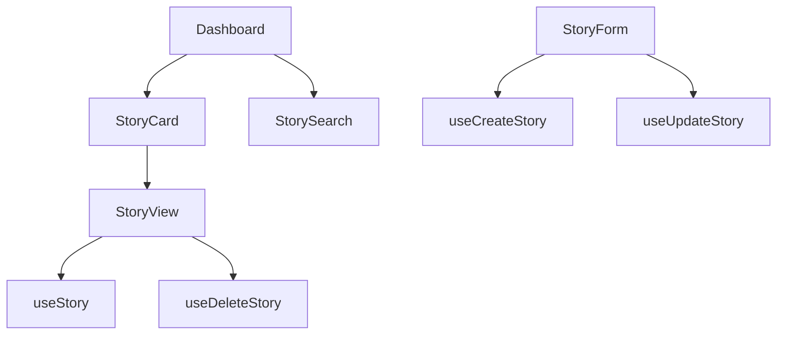
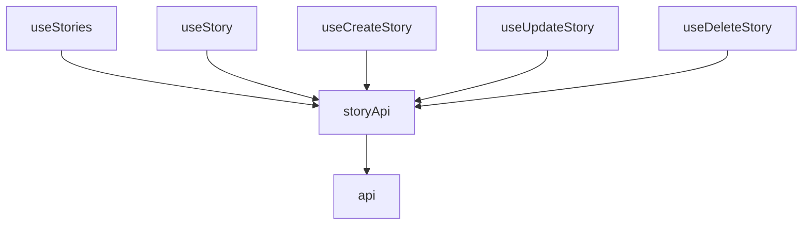
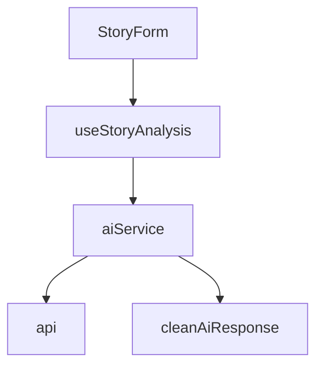

# StoryCraft Codebase Knowledge Graph

## Table of Contents
- [Frontend Architecture](#frontend-architecture)
- [Backend Architecture](#backend-architecture)
- [Database Schema](#database-schema)
- [API Endpoints](#api-endpoints)
- [Authentication Flow](#authentication-flow)
- [AI Integration](#ai-integration)
- [Development Setup](#development-setup)

## Frontend Architecture

### Core Components

### Authentication
- **LoginPage**: Handles user authentication
- **RegisterPage**: Manages new user registration
- **AuthProvider**: Manages authentication state and user session
- **token**: Handles JWT operations and storage

### Story Management
- **StoryCard**: Displays story preview in card format
- **StoryForm**: Handles story creation and editing with rich text
- **StoryView**: Displays full story content and handles editing
- **StorySearch**: Provides search and filtering functionality

### AI Features
- **aiService**: Handles AI-powered story analysis and enhancement
- **useStoryAnalysis**: Manages AI analysis state and operations
- **cleanAiResponse**: Utility for processing AI responses

## Hooks

### Data Fetching
- **useStories**: Fetches and manages story listings
- **useStory**: Fetches a single story by ID
- **useCreateStory**: Handles story creation
- **useUpdateStory**: Manages story updates
- **useDeleteStory**: Handles story deletion

### UI/State
- **useToast**: Manages toast notifications
- **useAuth**: Provides authentication context and methods

## Services
- **api**: Base API service for HTTP requests
- **storyApi**: Handles story-related API calls
- **aiService**: Manages AI-powered features

## Key Relationships

### Authentication Flow


### Story Management Flow


### Data Flow


### AI Integration


## Backend Architecture

### Core Components

#### FastAPI Application
- **Entry Point**: `main.py`
  - Configures CORS middleware
  - Sets up API routers
  - Handles lifespan events
  - Configures static files and templates

#### API Structure
- **Versioning**: `/api/v1`
- **Routers**:
  - `auth.py`: Authentication endpoints (login, register, token)
  - `users.py`: User management endpoints
  - `stories.py`: Story CRUD operations

#### Core Modules
- **Database**: SQLAlchemy ORM with async support
- **Authentication**: JWT token-based with OAuth2
- **Configuration**: Environment-based settings
- **Error Handling**: Custom exception handlers

## Database Schema

### Models

#### User
```python
class User(Base):
    __tablename__ = "users"
    
    id = Column(Integer, primary_key=True, index=True)
    email = Column(String, unique=True, index=True, nullable=False)
    hashed_password = Column(String, nullable=False)
    full_name = Column(String, nullable=True)
    is_active = Column(Boolean, default=True)
    is_superuser = Column(Boolean, default=False)
    created_at = Column(DateTime, default=datetime.utcnow)
    updated_at = Column(DateTime, default=datetime.utcnow, onupdate=datetime.utcnow)
    
    stories = relationship("Story", back_populates="owner")
```

#### Story
```python
class Story(Base):
    __tablename__ = "stories"
    
    id = Column(Integer, primary_key=True, index=True)
    title = Column(String, index=True, nullable=False)
    date = Column(String, nullable=False)
    content = Column(Text, nullable=False)
    tags = Column(String, default="")
    emotional_impact = Column(String, default="medium")
    analysis = Column(Text, nullable=True)
    owner_id = Column(Integer, ForeignKey("users.id"), nullable=False)
    created_at = Column(DateTime, default=datetime.utcnow)
    updated_at = Column(DateTime, default=datetime.utcnow, onupdate=datetime.utcnow)
    
    owner = relationship("User", back_populates="stories")
```

## API Endpoints

### Authentication
- `POST /api/v1/auth/register`: Register new user
- `POST /api/v1/auth/token`: Login and get access token
- `GET /api/v1/auth/me`: Get current user info

### Users
- `GET /api/v1/users/`: List users (admin only)
- `GET /api/v1/users/{user_id}`: Get user by ID (admin only)
- `PUT /api/v1/users/me`: Update current user

### Stories
- `GET /api/v1/stories/`: List user's stories
- `POST /api/v1/stories/`: Create new story
- `GET /api/v1/stories/{story_id}`: Get story by ID
- `PUT /api/v1/stories/{story_id}`: Update story
- `DELETE /api/v1/stories/{story_id}`: Delete story
- `POST /api/v1/stories/{story_id}/analyze`: Analyze story with AI

## Authentication Flow

1. User submits credentials to `/auth/token`
2. Server validates credentials and returns JWT token
3. Client stores token in memory/local storage
4. Token is included in `Authorization` header for subsequent requests
5. Server validates token on protected routes

## AI Integration

### Services
- **Story Analysis**: Analyzes story structure and content
- **Content Enhancement**: Improves story quality
- **Title Generation**: Suggests engaging titles

### Integration Points
- Story creation/editing
- Analysis dashboard
- Content suggestions

## Development Setup

### Environment Variables
```
# Database
DATABASE_URL=sqlite:///./storycraft.db
POSTGRES_SERVER=db
POSTGRES_USER=postgres
POSTGRES_PASSWORD=postgres
POSTGRES_DB=storycraft

# Security
SECRET_KEY=your-secret-key
ACCESS_TOKEN_EXPIRE_MINUTES=1440
ALGORITHM=HS256

# CORS
BACKEND_CORS_ORIGINS=["http://localhost:3000"]

# Server
SERVER_HOST=http://localhost:8000
```

### Running Locally
1. Set up Python virtual environment
2. Install dependencies: `pip install -r requirements.txt`
3. Run database migrations: `alembic upgrade head`
4. Start server: `uvicorn app.main:app --reload`

## Best Practices

### Frontend
1. Use React Query for data fetching and caching
2. Keep components focused and reusable
3. Handle loading and error states consistently
4. Use TypeScript for type safety
5. Follow React hooks rules and patterns

### Backend
1. Follow RESTful API design principles
2. Use dependency injection for testability
3. Implement proper error handling
4. Use Pydantic for request/response validation
5. Keep business logic in service layer

### Database
1. Use migrations for schema changes
2. Implement proper indexing
3. Use transactions for data integrity
4. Follow naming conventions
5. Document complex queries
